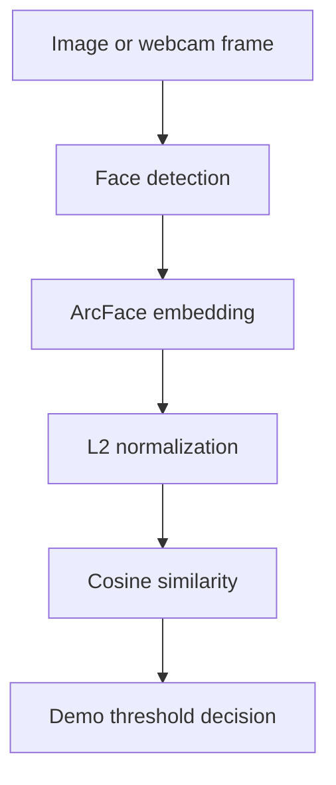

# Face Verification Demo

> A compact educational project that demonstrates face embeddings, cosine similarity, image comparison, and webcam-based 1:1 verification with InsightFace and OpenCV.

This repository documents two working stages of a face-verification learning path. It focuses on understanding how modern face systems represent a face as an embedding and how two embeddings can be compared.

## What is implemented

| Script | Implemented behavior |
| --- | --- |
| `test_face.py` | Detect faces in two images, extract ArcFace embeddings, compute cosine similarity, and print a simple match decision |
| `webcam_recognition.py` | Enroll one face in memory, compare live webcam frames against it, and display MATCH or NOT MATCH |

Both scripts use InsightFace's `buffalo_l` model package with the CPU execution provider.

## How it works



Modern face verification is a metric-learning problem:

1. Detect a face in an image.
2. Convert the face into a numerical embedding.
3. Normalize both embeddings.
4. Measure cosine similarity.
5. Compare the score with a calibrated threshold.

The threshold used in this repository is a demo default. It is not a universal percentage or a certified security threshold.

## Repository structure

```text
face-verification-demo/
|-- test_face.py            # Compare two image files
|-- webcam_recognition.py   # In-memory webcam enrollment and verification
|-- requirements.txt        # Original development environment snapshot
`-- README.md
```

## Quick start

Python 3.10 is recommended.

### 1. Create a virtual environment

```bash
python -m venv .venv
```

Windows PowerShell:

```powershell
.\.venv\Scripts\Activate.ps1
```

macOS or Linux:

```bash
source .venv/bin/activate
```

### 2. Install dependencies

`requirements.txt` captures the original development environment. For a minimal CPU-only trial, install:

```bash
python -m pip install --upgrade pip
pip install numpy opencv-python insightface onnxruntime
```

InsightFace may download the `buffalo_l` model package on first use.

### 3. Compare two images

Create an `images` directory and add:

```text
images/
|-- face1.jpg
`-- face3.jpg
```

Then run:

```bash
python test_face.py
```

The script prints the cosine similarity and a simple same-person/different-person decision.

### 4. Run webcam verification

```bash
python webcam_recognition.py
```

Controls:

- Press `S` to enroll the first detected face in memory.
- Keep the face visible to see the live similarity decision.
- Press `Q` to quit.

The current script opens camera index `1`. If no webcam feed appears, change this line in `webcam_recognition.py`:

```python
cap = cv2.VideoCapture(1)
```

to:

```python
cap = cv2.VideoCapture(0)
```

## What this project demonstrates

- Face detection with InsightFace.
- ArcFace embedding extraction.
- L2 normalization and cosine similarity.
- Image-to-image comparison.
- In-memory webcam enrollment.
- Real-time 1:1 verification feedback.

## Current limitations

This project is an educational prototype. It does **not** currently include:

- Persistent identity or embedding storage.
- 1:N identification against a user database.
- Liveness detection or presentation-attack defense.
- Face-quality checks.
- Threshold calibration on a representative validation set.
- Encryption, authentication, rate limiting, or access control.
- Audit logging or production monitoring.
- A service API or deployable user interface.

It should not be presented as a production KYC, banking, or security system.

## Responsible-use notes

- Use only images and webcam data for which you have permission.
- Treat face embeddings as sensitive biometric data.
- Do not rely on a single demo threshold for real identity decisions.
- Evaluate false-accept and false-reject rates on representative data before any real deployment.
- Add liveness detection and an additional authentication factor for security-sensitive use cases.

## Suggested next steps

- Add persistent enrollment with encrypted embedding storage.
- Separate enrollment and verification into explicit application states.
- Calibrate thresholds and report ROC, FAR, and FRR metrics.
- Add liveness detection and face-quality gating.
- Wrap verification behind a small API with structured audit events.
- Add automated tests for normalization and similarity decisions.

## Author

**Đào Danh Đăng Phụng**  
AI Engineer exploring applied computer vision, RAG, and GenAI systems.

- [GitHub](https://github.com/CoderNonTay)
- [LinkedIn](https://www.linkedin.com/in/%C4%91%C3%A0o-danh-%C4%91%C4%83ng-ph%E1%BB%A5ng-3453b933a/)

